# Application de Gestion de Covoiturage

## Description du Projet

Cette application de bureau, développée en Java, permet la gestion complète d'un service de covoiturage. Elle offre une interface utilisateur intuitive pour gérer les utilisateurs, les trajets, les réservations et les évaluations.

## Fonctionnalités Principales

### Gestion des Utilisateurs
- Création, modification et suppression des profils utilisateurs (conducteurs et passagers)
- Recherche d'utilisateurs par nom, prénom ou email
- Gestion des droits d'accès

### Gestion des Véhicules
- Ajout, modification et suppression de véhicules
- Association des véhicules aux conducteurs
- Recherche de véhicules par marque, modèle ou immatriculation

### Gestion des Trajets
- Création et gestion des trajets proposés
- Recherche de trajets par ville de départ, ville d'arrivée, date ou conducteur
- Affichage des détails des trajets (places disponibles, prix, etc.)

### Gestion des Réservations
- Réservation de places dans les trajets proposés
- Affichage des réservations en cours, passées et futures
- Gestion des statuts de réservation (confirmée, annulée, etc.)

### Évaluations et Avis
- Système d'évaluation des trajets effectués
- Affichage des avis et notes des utilisateurs

### Rapports et Statistiques
- Génération de rapports sur l'activité des conducteurs
- Visualisation du nombre de trajets par mois (diagramme en barres)
- Affichage des revenus mensuels par conducteur (diagramme circulaire)

### Authentification et Sécurité
- Système de connexion sécurisé
- Hachage des mots de passe pour une sécurité renforcée

## Technologies Utilisées

- **Langage de Programmation** : Java 17
- **Interface Utilisateur** : JavaFX
- **Persistance des Données** :
    - JPA (Java Persistence API)
    - Hibernate ORM
- **Base de Données** : MySQL
- **Gestion de Dépendances** : Maven
- **Autres Bibliothèques** :
    - BCrypt pour le hachage des mots de passe
    - JavaMail API pour l'envoi d'emails

## Architecture du Projet

L'application suit le modèle MVC (Modèle-Vue-Contrôleur) :
- **Modèle** : Représente les entités de données (Utilisateur, Trajet, Réservation, etc.)
- **Vue** : Interfaces utilisateur créées avec JavaFX et FXML
- **Contrôleur** : Gère la logique de l'application et fait le lien entre le modèle et la vue

## Installation et Configuration

1. Clonez le dépôt Git
2. Assurez-vous d'avoir Java 17 et Maven installés
3. Configurez votre base de données MySQL
4. Modifiez le fichier `hibernate.cfg.xml` avec vos paramètres de base de données
5. Exécutez `mvn clean install` pour construire le projet
6. Lancez l'application avec `java -jar target/nom-du-jar.jar`

## Captures d'écran

Voici quelques captures d'écran de l'application en action :

### Page de Connexion
* Page de connexion sécurisée pour accéder à l'application.
  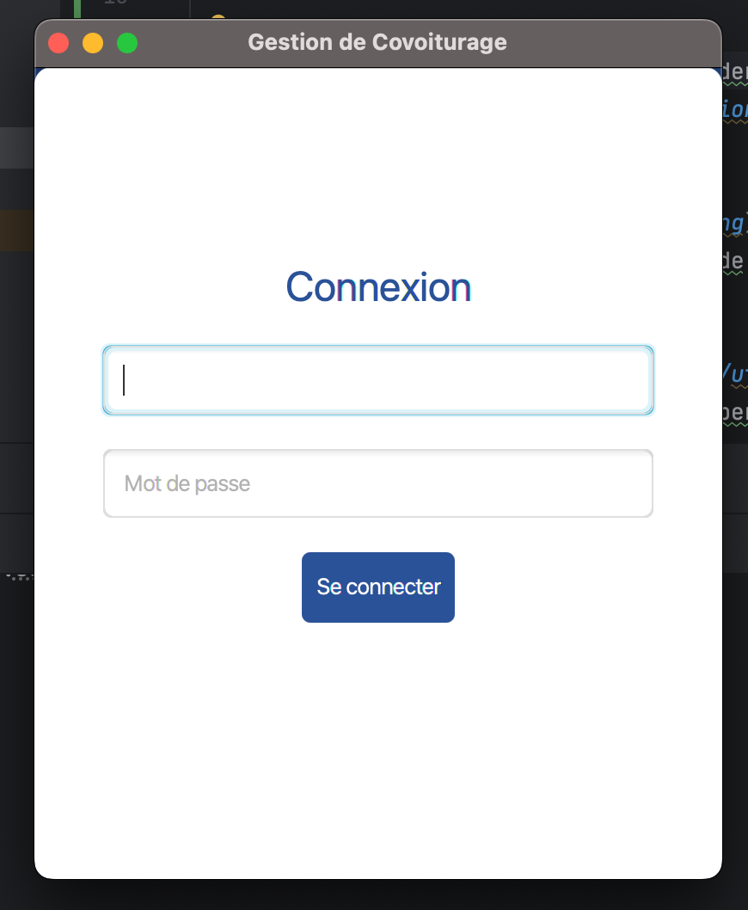

### Page d'accueil
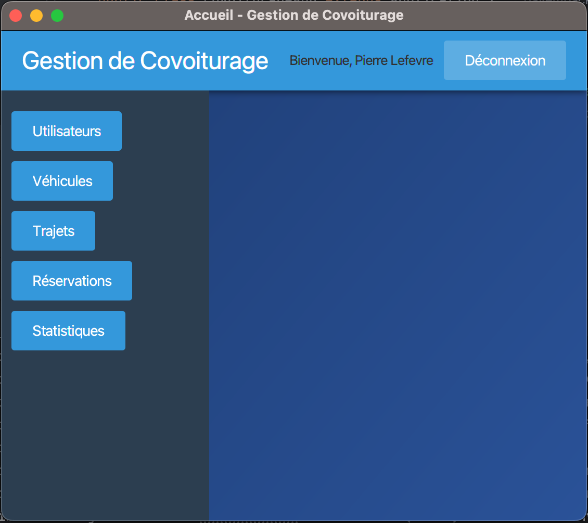
*La page d'accueil offre un aperçu rapide des fonctionnalités principales.*

### Gestion des utilisateurs
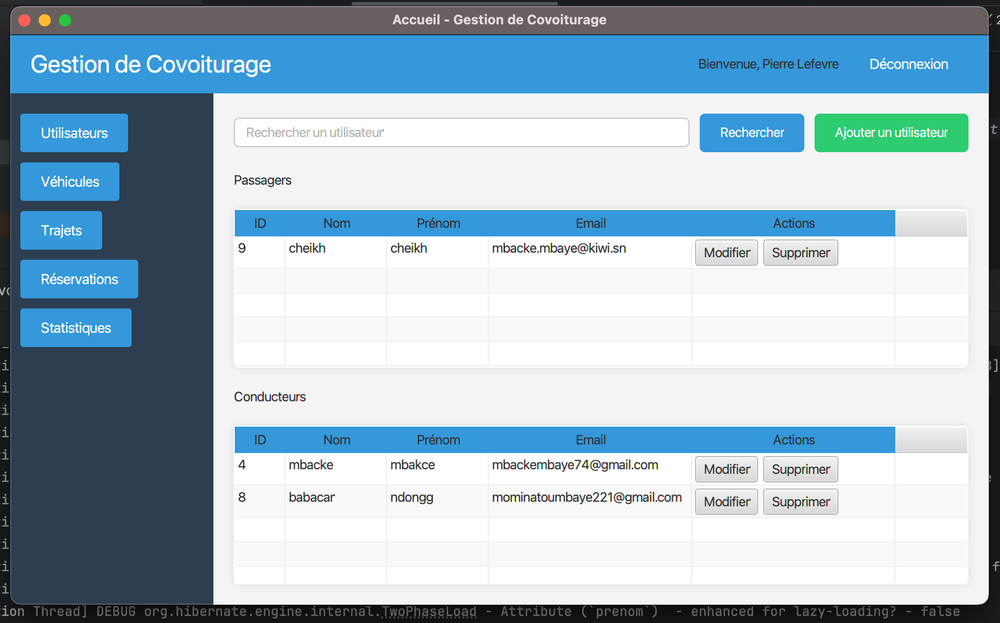
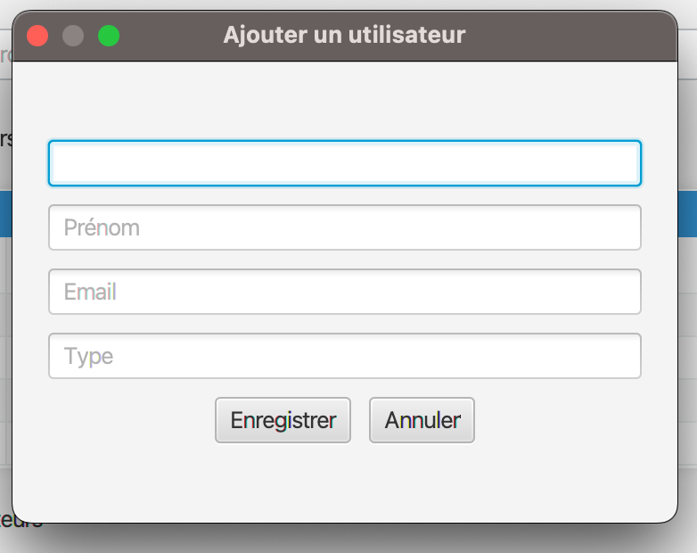
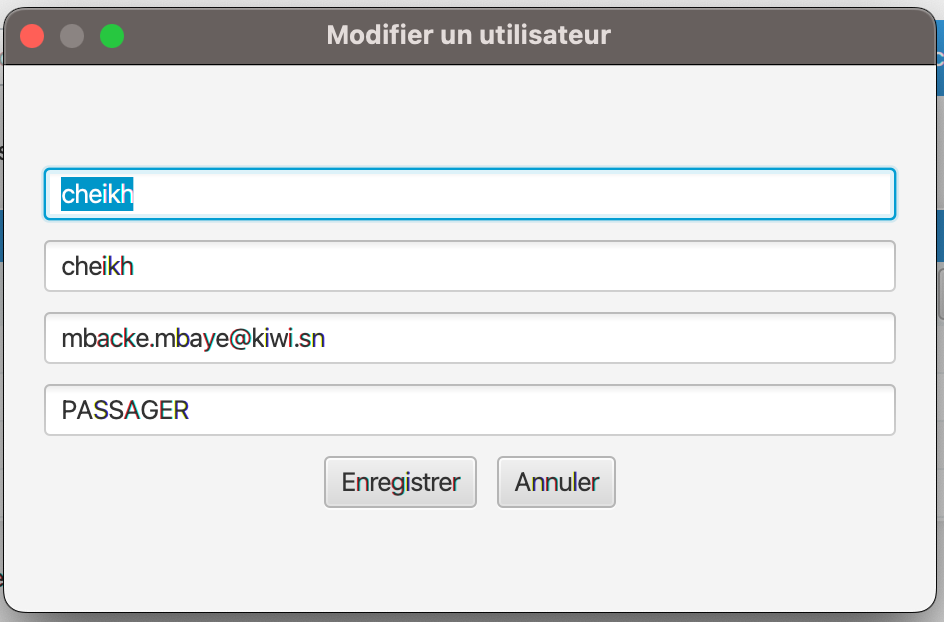
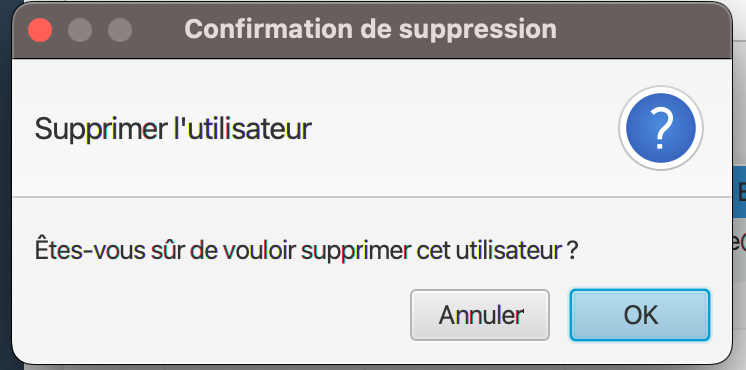
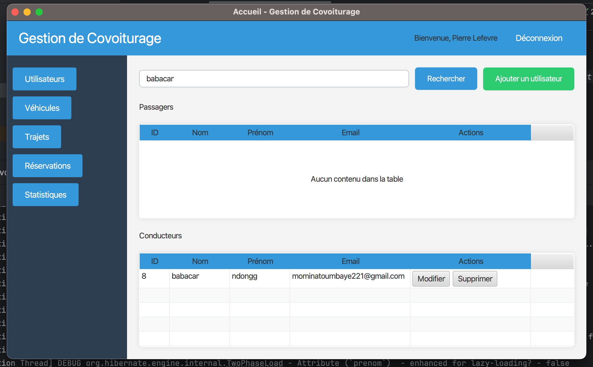
*Interface de gestion des utilisateurs permettant d'ajouter, modifier et supprimer des profils.*

### Gestion des trajets
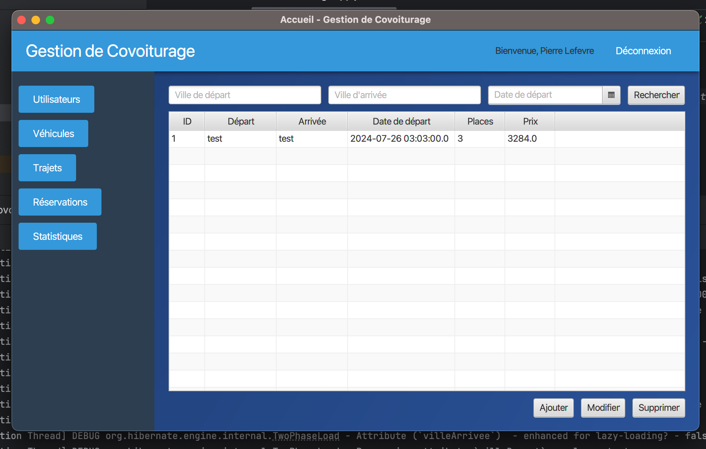
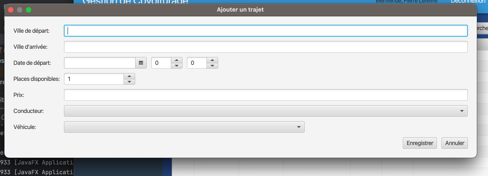
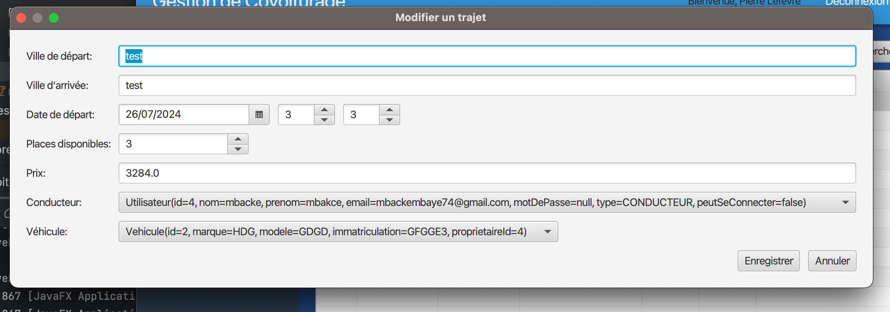
*Écran de recherche de trajets avec des filtres avancés.*

### Réservation d'un trajet
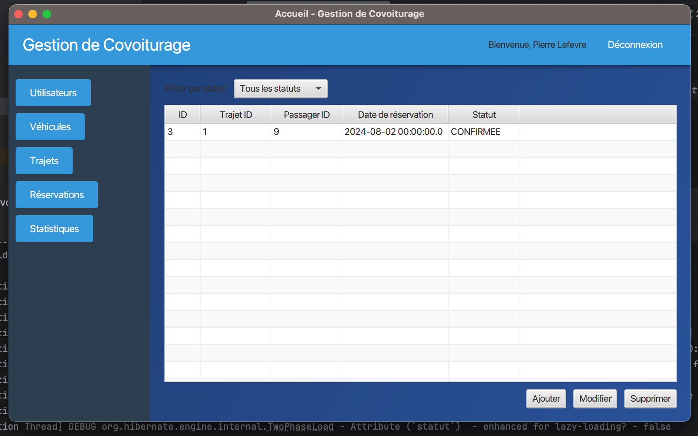
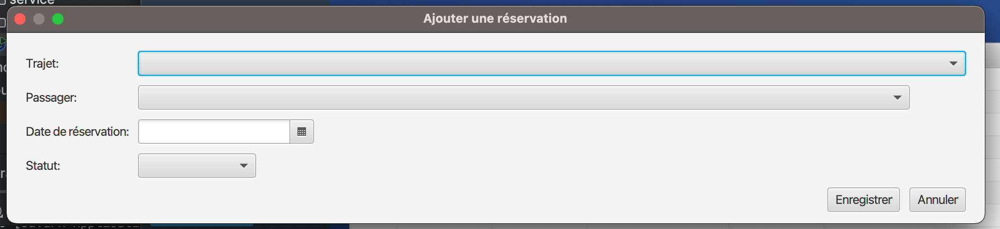
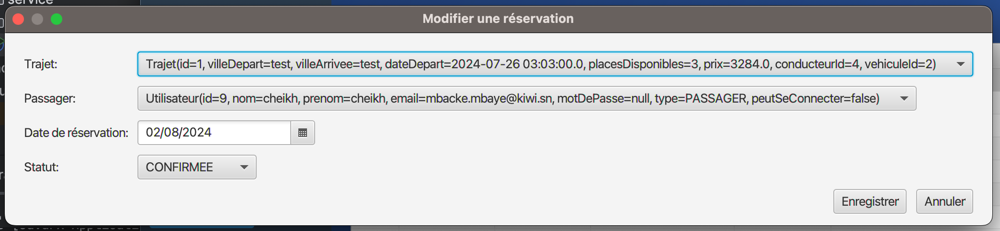
*Processus de réservation d'un trajet, simple et intuitif.*

### Tableau de bord statistiques
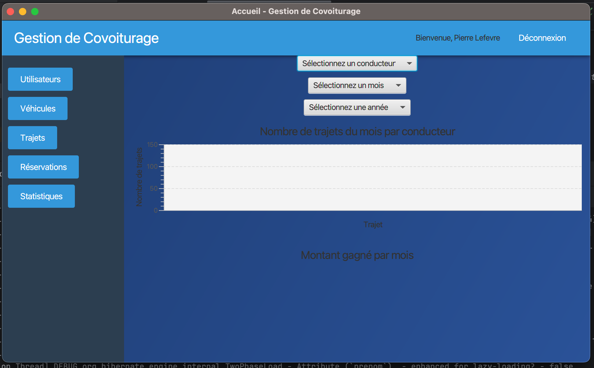
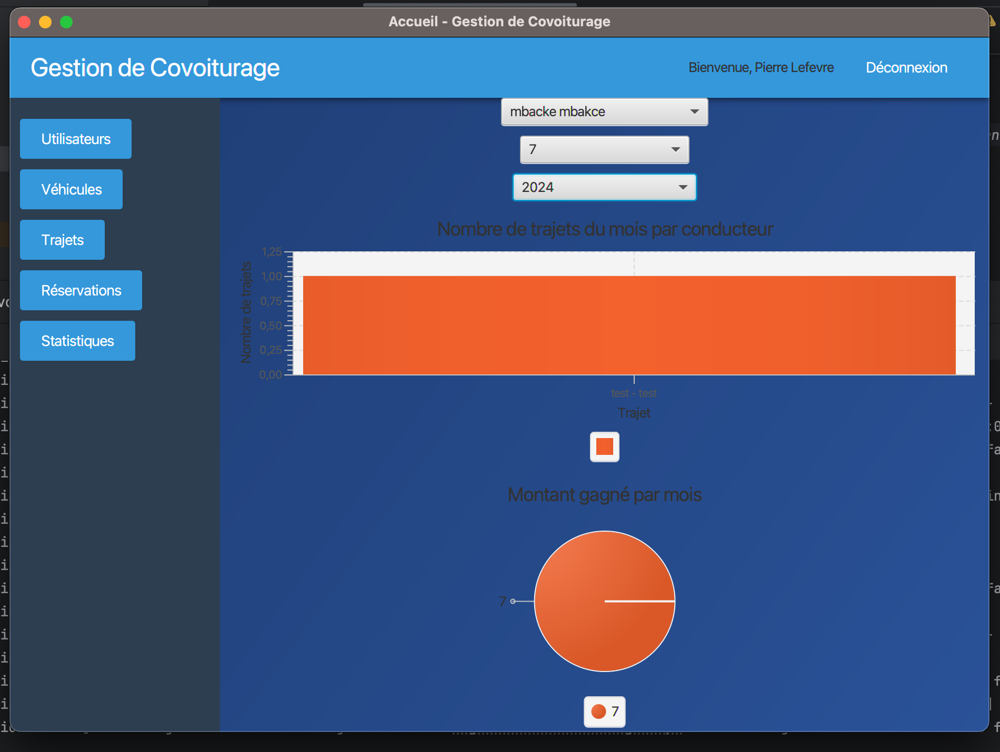
*Tableau de bord présentant des statistiques et graphiques sur l'utilisation du service.*

## Contribution

Les contributions à ce projet sont les bienvenues. Veuillez suivre ces étapes pour contribuer :
1. Forkez le projet
2. Créez votre branche de fonctionnalité (`git checkout -b feature/AmazingFeature`)
3. Committez vos changements (`git commit -m 'Add some AmazingFeature'`)
4. Poussez vers la branche (`git push origin feature/AmazingFeature`)
5. Ouvrez une Pull Request

## Licence

Ce projet est sous licence MIT. Voir le fichier `LICENSE` pour plus de détails.

## Contact

[Mbacke Mbaye] - [mbackembaye74@gmail.com]

Lien du projet : [https://github.com/bayembacke221/covoiturage.git](https://github.com/bayembacke221/covoiturage.git)